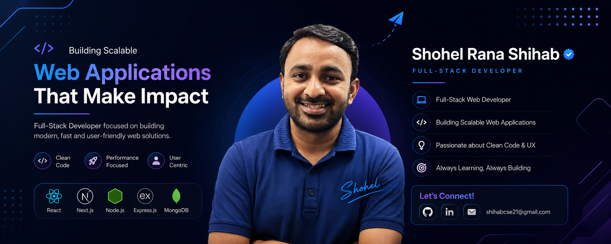

<h1 align="center">👋 Hi, I'm <strong>Shohel Rana Shihab</strong></h1>
<h3 align="center">Full-Stack Developer | React.js • Next.js • Node.js • Express.js • TypeScript • JavaScript | Problem Solver | Building Scalable Web Applications | Open to Remote Opportunities </h3>

## 🚀 About Me

I'm Shohel Rana Shihab, a Full-Stack Developer with 3+ years of hands-on experience building scalable and user-friendly web applications. I specialize in React, Next.js, TypeScript, Node.js, Express.js, and MongoDB, with a strong focus on clean code, performance, and intuitive user experiences. I'm passionate about solving real-world problems, continuously learning new technologies, and building software that makes an impact.

## 🧠 What I Do

- 💻 Build modern, responsive, and scalable full-stack web applications.
- ⚛️ Develop interactive user interfaces with React.js and Next.js.
- 🛠️ Create secure backend APIs using Node.js, Express.js, and MongoDB.
- 🚀 Focus on clean code, performance optimization, and great user experiences.
- 🧩 Solve real-world problems through practical and scalable software solutions.
- 📚 Continuously learn new technologies and improve my development skills.
- 🤝 Collaborate with developers and contribute to meaningful projects.

## 🧰 Skills & Tools

- **Frontend:** React, Next.js, TailwindCSS  
- **Backend:** Node.js, Express, PostgreSQL   
- **Languages:** JavaScript, TypeScript  
- **Design:** Figma, UX Principles  

## 💬 Let's Connect
I'm always open to discussing Frontend & Full-Stack Developer opportunities, collaborating on exciting projects, or connecting with fellow developers.
📧 Email: shihabcse21@gmail.com
💼 LinkedIn: https://www.linkedin.com/in/rshihab21

## ⭐ Support My Work

If my open-source or content work has helped you, consider giving a ⭐ to my projects or supporting me through [GitHub Sponsors](https://github.com/sponsors/atapas).
